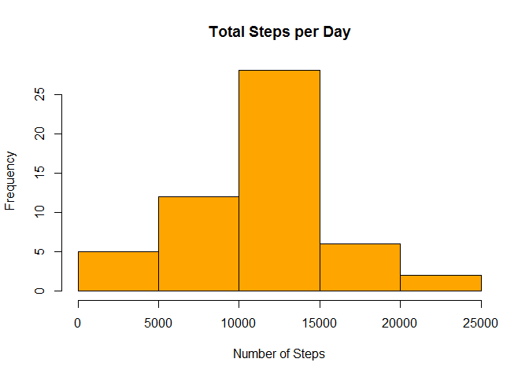
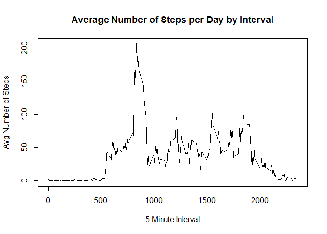
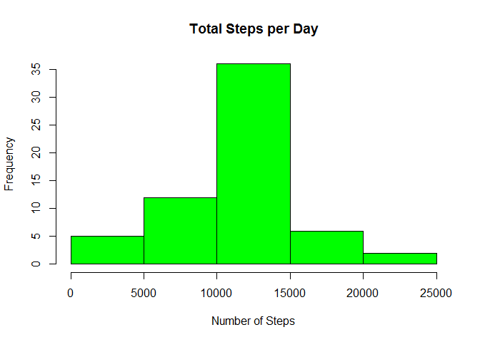
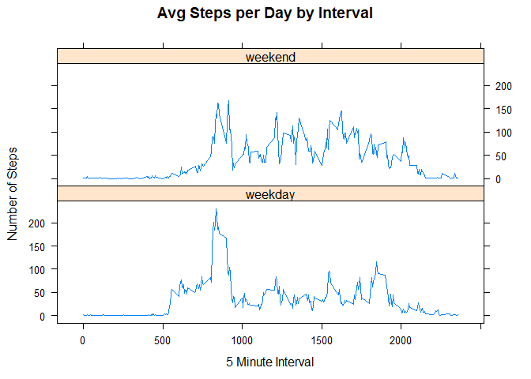

# Reproducible Research: Peer Assessment 1
## Introduction
It is now possible to collect a large amount of data about personal movement using activity monitoring devices such as a Fitbit, Nike Fuelband, or Jawbone Up. These type of devices are part of the "quantified self" movement - a group of enthusiasts who take measurements about themselves regularly to improve their health, to find patterns in their behavior, or because they are tech geeks. But these data remain under-utilized both because the raw data are hard to obtain and there is a lack of statistical methods and software for processing and interpreting the data.

This assignment makes use of data from a personal activity monitoring device. This device collects data at 5 minute intervals through out the day. The data consists of two months of data from an anonymous individual collected during the months of October and November, 2012 and include the number of steps taken in 5 minute intervals each day.

## Data
The data for this assignment was downloaded from the course web
site:

* Dataset: [Activity monitoring data](https://d396qusza40orc.cloudfront.net/repdata%2Fdata%2Factivity.zip) [52K]

The variables included in this dataset are:

* **steps**: Number of steps taking in a 5-minute interval (missing
    values are coded as `NA`)

* **date**: The date on which the measurement was taken in YYYY-MM-DD
    format

* **interval**: Identifier for the 5-minute interval in which
    measurement was taken

The dataset is stored in a comma-separated-value (CSV) file and there are a total of 17,568 observations in this dataset.

## Loading and preprocessing the data

Unzip and load the data into a data frame `data`. 

```r
unzip(zipfile="repdata_data_activity.zip")
data <- read.csv("activity.csv")
```
## What is mean total number of steps taken per day?
1. Calculate the total number of steps taken per day
2. Make a histogram of the total number of steps taken each day
3. Calculate and report the mean and median of the total number of steps taken per day


```r
steps_per_day <- aggregate(steps ~ date, data, sum)

hist(steps_per_day$steps,main = "Total Steps per Day",col="orange",
     xlab="Number of Steps")
```

<!-- -->

```r
step_mean <- mean(steps_per_day$steps)
step_median <- median(steps_per_day$steps)
```
The `mean` of steps per day is 1.0766189\times 10^{4} and the `median` of steps per day is 10765.


## What is the average daily activity pattern?
1. Make a time series plot of the 5-minute interval (x-axis) and the average number of steps taken, averaged across all days (y-axis).
2. Which 5-minute interval, on average across all the days in the dataset, contains the maximum number of steps?


```r
step_int_avg <- aggregate(steps ~ interval, data, mean)

plot(step_int_avg$interval,step_int_avg$steps, type = "l", xlab = "5 Minute Interval", 
     ylab = "Avg Number of Steps", main = "Average Number of Steps per Day by Interval")
```

<!-- -->

```r
max_interval <- step_int_avg[which.max(step_int_avg$steps),1]
```

The 5-minute interval, on average across all the days in the data set, with the maximum number of steps is interval 835.

## Impute missing values. Compare imputed to non-imputed data.
1. Calculate and report the total number of missing values in the dataset (i.e. the total number of rows with NAs)


```r
incomplete_count <- sum(!complete.cases(data))
```
        * The number of missing cases in the data is 2304

2. Devise a strategy for filling in all of the missing values in the dataset. *For the purposes of this analysis, the mean of each five minute interval was used.*
3. Create a new dataset that is equal to the original dataset but with the missing data filled in.


```r
imputed_data <- transform(data, steps = ifelse(is.na(data$steps),
        step_int_avg$steps[match(data$interval, step_int_avg$interval)], data$steps))
```

4. Make a histogram of the total number of steps taken each day and calculate and report the mean and median total number of steps taken per day. 


```r
steps_per_day_impute <- aggregate(steps ~ date, imputed_data, sum)

hist(steps_per_day_impute$steps,main = "Total Steps per Day",col="green",
     xlab="Number of Steps")
```

<!-- -->

```r
step_mean_impute <- mean(steps_per_day_impute$steps)
step_median_impute <- median(steps_per_day_impute$steps)
```
* The imputed data mean is 1.0766189\times 10^{4}
* The imputed data median is 1.0766189\times 10^{4}

5. Do these values differ from the estimates from the first part of the assignment? 


```r
step_mean_diff <- step_mean_impute - step_mean
step_median_diff <- step_median_impute - step_median
step_sum_diff <- sum(steps_per_day_impute$steps) - sum(steps_per_day$steps)
```
* The difference between the non-imputed mean and imputed mean is 0
* The difference between the non-imputed median and imputed median is 1.1886792
* The difference between total number of steps between imputed and non-imputed data is 8.6129509\times 10^{4}. 
6. What is the impact of imputing missing data on the estimates of the total daily number of steps?
* As a result, there are 8.6129509\times 10^{4} more steps in the imputed data and the median has shifted
by 1.1886792

## Are there differences in activity patterns between weekdays and weekends?
1. Create a new factor variable in the dataset with two levels - "weekday" and "weekend" indicating whether a given date is a weekday or weekend day.
2. Make a panel plot containing a time series plot of the 5-minute interval (x-axis) and the average number of steps taken, averaged across all weekday days or weekend days (y-axis).


```r
imputed_data$date_type <- ifelse(as.POSIXlt(imputed_data$date)$wday %in% c(0,6),
        'weekend','weekday')

step_int_dtype_avg <- aggregate(steps ~ interval + date_type, imputed_data, mean)

library(lattice)

xyplot(step_int_dtype_avg$steps ~ step_int_dtype_avg$interval|step_int_dtype_avg$date_type, 
       main="Avg Steps per Day by Interval",xlab="5 Minute Interval", ylab="Number of Steps",
       layout=c(1,2), type="l")
```

<!-- -->
